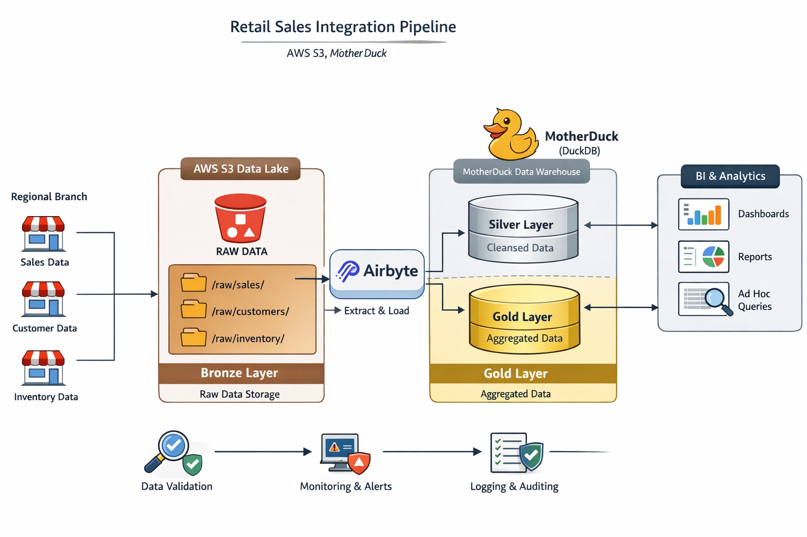

# Retail Sales Integration Pipeline

This repository scaffolds a branch-to-cloud retail integration pipeline for sales, customers, products, and inventory data. It covers:

- CSV dataset preparation for regional branches
- AWS S3 Bronze, Silver, and Gold layout
- S3 bucket versioning and lifecycle configuration with `boto3`
- Local data cleansing and aggregation before warehouse sync
- Airbyte source and destination templates for S3, MotherDuck, and Snowflake
- Validation SQL for warehouse quality checks
- Monitoring report generation and implementation guidance

## Pipeline Overview



## Architecture

The project follows a Medallion pattern:

- Bronze: raw CSV files stored in S3 under `raw/`
- Silver: cleansed, typed, normalized parquet files under `silver/`
- Gold: business-facing aggregates under `gold/`

Reference diagram: [docs/medallion_architecture.md](docs/medallion_architecture.md)

## Repository Layout

```text
.
├── airbyte/config/
├── data/raw/
├── docs/
├── reports/
├── sql/
└── src/retail_sales_pipeline/
```

## Prerequisites

- Python 3.11+
- AWS account and permissions for S3 bucket administration
- Airbyte instance with access to S3 and MotherDuck or Snowflake
- MotherDuck token or Snowflake credentials

## Quick Start

1. Create and activate a virtual environment.
2. Install dependencies:

```bash
pip install -r requirements.txt
pip install -e .
```

3. Copy `.env.example` to `.env` and fill in the secrets.
4. Verify the CLI is installed:

```bash
retail-sales-pipeline --help
```

You can also run the package as a module:

```bash
python -m retail_sales_pipeline --help
```

5. Bootstrap the S3 bucket and lifecycle rules:

```bash
retail-sales-pipeline setup-s3
```

6. Upload raw CSV files into the Bronze layer:

```bash
retail-sales-pipeline upload-raw
```

7. Build local Silver and Gold assets for downstream sync and validation:

```bash
retail-sales-pipeline transform
```

8. Generate a monitoring report from the transformed outputs:

```bash
retail-sales-pipeline report
```

## Docker

Build the image:

```bash
docker build -t retail-sales-pipeline .
```

Run a local transformation job and write outputs back into this repository:

```bash
docker run --rm \
	--env-file .env \
	-v "$PWD/data:/app/data" \
	-v "$PWD/reports:/app/reports" \
	retail-sales-pipeline transform
```

Generate a quality report:

```bash
docker run --rm \
	--env-file .env \
	-v "$PWD/data:/app/data" \
	-v "$PWD/reports:/app/reports" \
	retail-sales-pipeline report
```

Bootstrap S3 or upload raw files with the same image:

```bash
docker run --rm --env-file .env retail-sales-pipeline setup-s3
docker run --rm --env-file .env retail-sales-pipeline upload-raw
```

If you prefer Docker Compose, the repo includes `compose.yaml`:

```bash
docker compose run --rm pipeline transform
docker compose run --rm pipeline report
```

## Airbyte Setup

Use the JSON templates in [airbyte/config](airbyte/config):

- `source_s3.template.json`
- `destination_motherduck.template.json`
- `destination_snowflake.template.json`
- `connection.template.json`

Recommended sync cadence: daily at 02:00 UTC. If late-arriving branch files are common, switch to twice daily.

## Validation

Validation SQL is organized by warehouse target:

- MotherDuck: [sql/validation/motherduck_validation.sql](sql/validation/motherduck_validation.sql)
- Snowflake: [sql/validation/snowflake_validation.sql](sql/validation/snowflake_validation.sql)

These checks cover:

- Row count reconciliation between Bronze and warehouse tables
- Null checks on critical business keys
- Data type and value-range validation
- Aggregate validation for sales and inventory outputs

## Notes on MotherDuck vs Snowflake

Your scope references MotherDuck as the main destination and Snowflake in the warehouse validation section. This project supports both:

- MotherDuck is the default target via `.env`
- Snowflake templates and validation SQL are included so the destination can be switched without restructuring the repository

## Reporting and Monitoring

`retail-sales-pipeline report` generates a JSON summary in `reports/` with dataset counts, null checks, and aggregate snapshots. Airbyte operational monitoring still happens in the Airbyte UI and logs.
