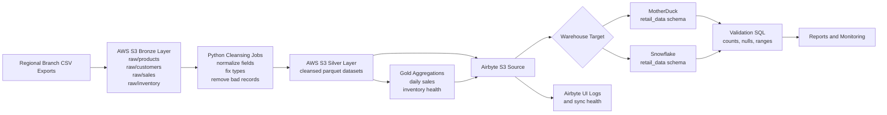

# Medallion Architecture Diagram

## Layer Responsibilities

- Bronze: immutable raw branch extracts stored in S3 with versioning enabled
- Silver: cleaned and typed datasets aligned to warehouse schema expectations
- Gold: domain aggregates used for BI dashboards, alerts, and reporting
